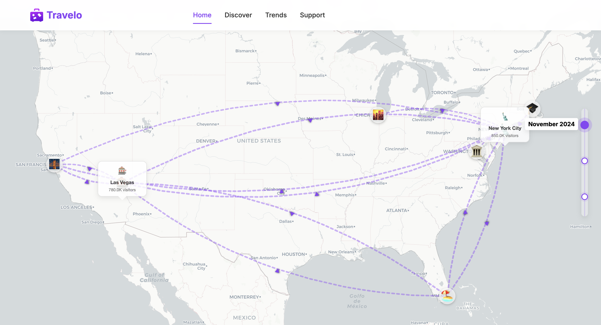
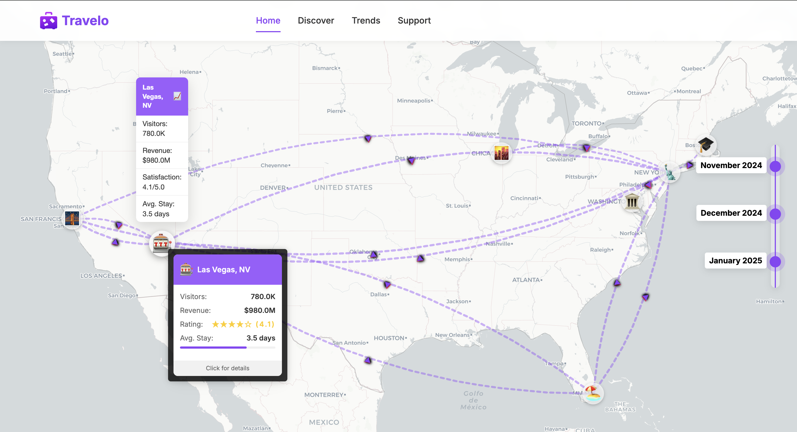
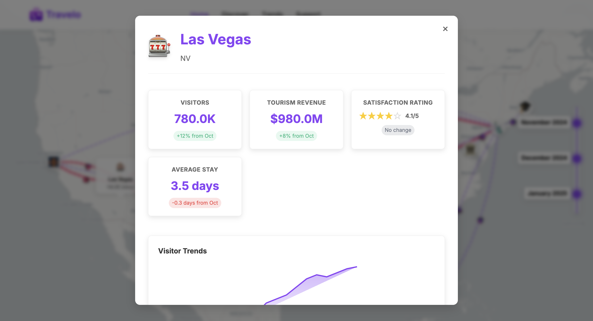

# 🗺️ U.S. Tourism Trends 2024–2025 

An interactive data storytelling project visualizing U.S. tourism patterns across major cities during the 2024–2025 holiday season. Featuring animated curved flow lines, emoji-enhanced city markers, trend charts, and responsive design, this project blends data visualization with engaging scrollytelling.

---

## 🌟 Project Overview

This project visualizes tourism trends from **Thanksgiving to New Year**, showing how people travel between major U.S. cities. Users can interact with a dynamic map, explore detailed city stats, and view how patterns evolve month by month.

Inspired by **New York Times' "How the Virus Won"** visualization, this project transforms tourism data into an immersive storytelling experience through animated Bezier curve flow lines, strategically-placed emoji landmarks, and dynamic data visualization cards that reveal patterns across American cities.

---

## ✨ Key Features improved

### 🗺️ Interactive Map
- **Emoji City Markers** – Themed emojis for cities (e.g., 🎰 for Las Vegas)
- **Animated Curved Flow Lines** – Visualize tourism flow between cities
- **Data Cards** – Quick stats displayed on the map
- **Timeline Navigation** – View monthly travel trends
- **Highlighted Connections** – Focus on flows related to the selected city

### 📊 City Detail Modal
- **Trend Indicators** – Green/red badges for monthly changes
- **Star Ratings** – Visualize user satisfaction
- **Trend Charts** – Mini line charts for tourism over time
- **Clean Card Layout** – Well-structured statistics
- **Consistent Branding** – Unified color palette and typography

---

## 🔄 Key Enhancements

### 1. 🎨 Visual Design
- Consistent purple-based color scheme
- Refined card layout with shadows and spacing
- Google Fonts integration (`Inter`)
- Responsive and mobile-friendly interface

### 2. 🧭 Map & Animation
- Bezier curves for smoother flow lines  
- Line thickness based on visitor volume  
- Animated CSS effects for motion  
- Arrow markers for direction  
- Context-aware highlighting  

### 3. 📈 Data Presentation
- Trend comparisons from previous months  
- Line charts showing visitor trends  
- Star rating system  
- Top attractions lists per city  
- Progress bars for average stay duration  

### 4. ⚙️ Technical Highlights
- **Debounce & Throttle** functions for performance
- **Responsive Layouts** for all screen sizes
- **Intersection Observer API** for scroll-triggered animations
- **Modular Codebase** with improved separation of concerns

---

## 🧩 Technologies Used

| Tool/Library | Purpose |
|--------------|---------|
| 🗺️ [Leaflet.js](https://leafletjs.com) | Interactive mapping |
| 🎬 [GSAP](https://greensock.com/gsap/) | Smooth animations & scroll effects |
| 💻 JavaScript (ES6+) | Core logic & DOM interaction |
| 🎨 HTML5 + CSS3 | Structure & responsive design |
| 🖌️ CSS Variables & Grid | Theming & layout |

---

## 📂 Project Structure

## 📁 Project Structure

```text
us-tourism-trends/
├── css/
│   └── styles.css          # Main stylesheet with advanced visual styling
├── js/
│   ├── imap.js             # Enhanced map visualization with curved flows
│   ├── main.js             # Main application logic with animations
│   ├── timeline.js         # Timeline navigation component
│   └── data.js             # Tourism data handling
├── data/
│   ├── tourism.json        # Tourism statistics and metrics
│   └── world.json          # GeoJSON data for map boundaries
├── index.html              # Main HTML structure with scrollytelling
├── assets/
│   ├── image.png           # Logo
│   ├── Screenshot1.png     # Project screenshot 1
│   ├── Screenshot2.png     # Project screenshot 2
│   └── Screenshot3.png     # Project screenshot 3
└── README.md               # Project documentation

```
---

## 📸 Screenshot Highlights

### Screenshot 1 – Interactive Map



### Screenshot 2 – City Detail Modal



### Screenshot 3 – City Detail Popup


